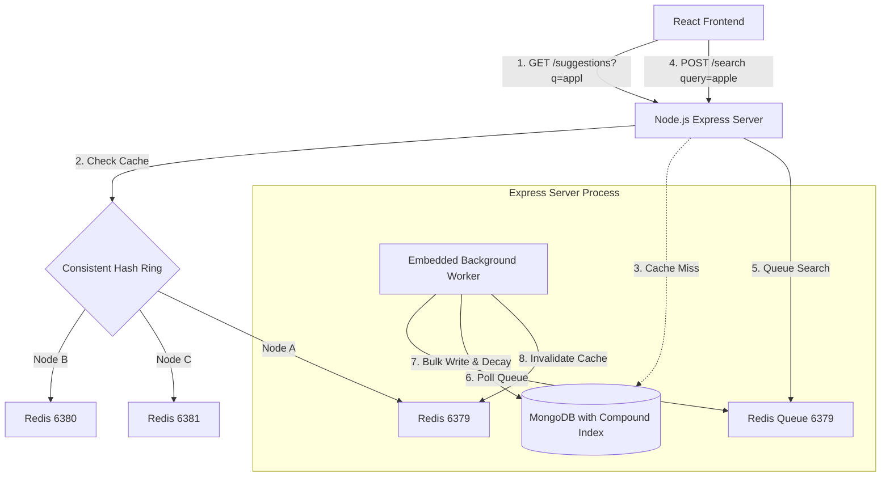

# Search Typeahead Autocomplete System

A highly scalable, production-ready Search Typeahead (autocomplete) system designed to handle 100k+ Daily Active Users (DAU) with sub-50ms latency. The system features a stateless prefix query design, distributed cache-aside routing via a consistent hash ring, and an embedded background log-aggregation worker with exponential decay trending scores.

---

## Architectural Choices & Scalability

### Why We Removed the Stateful In-Memory Trie
While in-memory Tries (Prefix Trees) offer fast query lookups, they introduce major architectural bottlenecks in production distributed environments:
1. **Memory Footprint**: Keeping millions of search terms in RAM on every application server leads to high memory bloat, especially as the search corpus grows.
2. **State Synchronization Complexity**: In a multi-instance backend, keeping in-memory Tries synchronized in real-time when new searches are logged requires complex coordination (e.g., Redis Pub/Sub broadcast or database polling). Any lag results in inconsistent suggestions across instances.
3. **Cold Boot Latency**: Rebuilding a large Trie in memory on server boot requires scanning the entire database, causing long boot delays (cold starts) before a server can accept traffic.

### Our Solution: Stateless Prefix DB Querying
We replaced the in-memory Trie with a **Stateless prefix matching architecture**:
- **Indexed DB Queries**: We utilize an optimized compound index on MongoDB: `{ query: 1, trending_score: -1, frequency: -1 }`.
- **Stateless Scaling**: Backend servers remain completely stateless. They query MongoDB using a fast regex prefix match (`/^prefix/i`) and sort results by trending score and frequency. This allows us to scale Express instances horizontally behind a load balancer with zero sync overhead.
- **Cache-Aside Routing**: A Consistent Hash Ring routes and caches frequent prefix results on Redis nodes (ports 6379, 6380, and 6381) with a 5-minute TTL. This bypasses the database completely for high-traffic keystrokes, maintaining sub-15ms p95 latencies.

---

## System Architecture



---

## Directory Structure

```
.
├── backend/
│   ├── src/
│   │   ├── config/
│   │   │   ├── db.ts               # MongoDB + Redis Connections
│   │   │   └── hash-ring.ts        # Consistent Hashing FNV-1a Ring router
│   │   ├── models/
│   │   │   ├── query.model.ts      # Aggregated queries model (indexed)
│   │   │   └── search-log.model.ts # Raw search log model
│   │   ├── services/
│   │   │   ├── worker.ts           # Embedded background aggregation worker
│   │   │   ├── cache.ts            # Cache-aside client using the Hash Ring
│   │   │   └── queue.ts            # Redis list write-buffer queue
│   │   ├── controllers/
│   │   │   ├── suggestion.ts       # GET /suggestions prefix query
│   │   │   ├── search.ts           # POST /search queue logger
│   │   │   ├── trending.ts         # GET /trending reporter
│   │   │   └── cache-debug.ts      # GET /cache/debug router inspector
│   │   ├── routes.ts               # API endpoint routing
│   │   ├── app.ts                  # Express Middlewares configuration
│   │   ├── server.ts               # Express bootstrapper + Background Worker scheduler
│   │   └── seed.ts                 # Database seed script (streams amazon_products.csv)
│   ├── package.json
│   └── tsconfig.json
├── frontend/
│   ├── src/
│   │   ├── components/
│   │   │   └── SearchBar.tsx       # Autocomplete UI, latency badges, keyboard navigation
│   │   ├── hooks/
│   │   │   └── useDebounce.ts      # Debounce input utility hook (300ms)
│   │   ├── App.tsx                 # Clean UI landing page
│   │   ├── index.css               # CSS animations, glassmorphic filters, Tailwind imports
│   │   └── main.tsx
│   ├── package.json
│   ├── postcss.config.js
│   ├── tailwind.config.js
│   └── vite.config.ts
├── amazon_products.csv             # Ingested dataset source
└── .env                            # Shared connection environments
```

---

## Setup and Run Instructions

### Prerequisites
- **Node.js** (v20+ recommended) & **npm**
- **MongoDB** running locally on default port `27017`
- **WSL (Windows Subsystem for Linux)** running with `redis-server` installed

### 1. Launch Services
Ensure MongoDB is running, and start the three Redis cache instances in WSL:
```powershell
# In PowerShell: Start local MongoDB
Start-Process -FilePath "C:\Program Files\MongoDB\Server\8.2\bin\mongod.exe" -ArgumentList "--dbpath=""c:\WORK\Scaler\HLD\Search Typehead\mongodb_data"" --port 27017 --bind_ip 127.0.0.1" -NoNewWindow

# In PowerShell: Start Redis servers on 6379, 6380, 6381 inside WSL
wsl -u root -d kali-linux bash -c "redis-server --port 6379 --daemonize yes && redis-server --port 6380 --daemonize yes && redis-server --port 6381"
```

### 2. Seed the Database
Extract and seed **105,000 unique queries** from the local Amazon products CSV:
```bash
cd backend
npx ts-node src/seed.ts
```

### 3. Start Backend server
```bash
cd backend
npm run dev
```
*Starts the Express application on port `5000` and launches the embedded background worker.*

### 4. Run React Frontend
```bash
cd frontend
npm run dev
```
Open `http://localhost:5173` in your browser.

---

## API Specifications

### 1. GET /suggestions
Fetches top autocomplete prefix suggestions.
- **URL**: `/suggestions?q={prefix}`
- **Method**: `GET`
- **Query Params**:
  - `q` (required): prefix keyword
- **Response Headers**:
  - `X-Cache`: `HIT` / `MISS`
  - `X-Response-Time`: Latency in milliseconds (e.g. `2.50ms`)
- **Example Response**:
  ```json
  [
    {
      "query": "apple watch charger",
      "frequency": 2420,
      "trending_score": 7.42,
      "timestamp": "2026-06-22T00:20:00.000Z"
    }
  ]
  ```

### 2. POST /search
Submits a selected search keyword. Pushes hit to write queue.
- **URL**: `/search`
- **Method**: `POST`
- **Payload**:
  ```json
  {
    "query": "apple ipad pro"
  }
  ```
- **Example Response**:
  ```json
  {
    "success": true,
    "message": "Search registered in write queue successfully."
  }
  ```

### 3. GET /trending
Retrieves top 10 globally trending searches.
- **URL**: `/trending`
- **Method**: `GET`
- **Example Response**:
  ```json
  [
    {
      "query": "luggage sets expandable",
      "frequency": 1824,
      "trending_score": 84.14
    }
  ]
  ```

### 4. GET /cache/debug
Debug router mapping for Consistent Hashing testing.
- **URL**: `/cache/debug?prefix={x}`
- **Method**: `GET`
- **Example Response**:
  ```json
  {
    "prefix": "lug",
    "prefixHash": 3527218685,
    "assignedNode": "localhost:6380",
    "cacheKey": "prefix:lug",
    "existsInCache": true
  }
  ```
