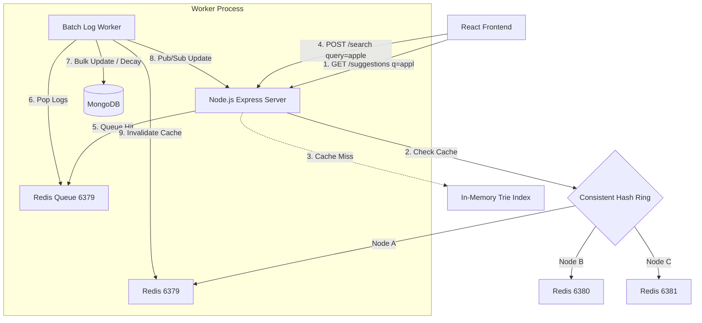

# Search Typeahead Autocomplete System

A highly scalable, production-ready Search Typeahead (autocomplete) system designed to handle 100k+ Daily Active Users (DAU) with sub-50ms latency. The system features an in-memory Trie (Prefix Tree), Levenshtein-based typo tolerance, distributed cache-aside routing via a consistent hash ring, and asynchronous batch worker logs processing with exponential decay relevance ranking.

---

## System Architecture Overview



1. **Client / Frontend**: React interface (TypeScript, Tailwind v4). Debounces keys at **300ms** and handles arrow-key traversal. Employs regional personalization filters.
2. **Backend Server**: Node.js/Express. Hosts the loaded in-memory Trie index for rapid suggestions. Connects to 3 local Redis nodes.
3. **Consistent Hash Ring**: Uses FNV-1a hashing to distribute cache keys across Redis ports 6379, 6380, and 6381 with 150 virtual nodes per server, preventing hot spots.
4. **Fuzzy Search / Typo Tolerance**: If exact prefix matches yield fewer than 10 suggestions, the Trie walks a recursive Levenshtein edit distance lookup (threshold = 1 or 2).
5. **Decoupled Queue & Aggregator**: Search requests logged to `POST /search` are buffered inside a Redis list queue (`search_log_queue`). A background worker aggregates them, logs raw entries, and decay-ranks historical scores in MongoDB.
6. **Real-time Pub/Sub Sync**: When the worker aggregates queries, it publishes the updates to `trie_updates`. The Express server subscribes to this and updates the Trie in-place.

---

## Directory Structure

```
.
├── backend/
│   ├── src/
│   │   ├── config/
│   │   │   ├── db.ts               # MongoDB and Redis connection managers
│   │   │   └── hash-ring.ts        # Consistent Hashing FNV-1a Ring router
│   │   ├── models/
│   │   │   ├── query.model.ts      # Aggregated queries model
│   │   │   └── search-log.model.ts # Raw search logging model
│   │   ├── services/
│   │   │   ├── trie.ts             # Trie character tree + Levenshtein fuzzy search
│   │   │   ├── trie-instance.ts    # Trie singleton exporter
│   │   │   ├── cache.ts            # Cache-aside client using the Hash Ring
│   │   │   └── queue.ts            # Buffer queue interface
│   │   ├── controllers/
│   │   │   ├── suggestion.ts       # GET /suggestions handler
│   │   │   ├── search.ts           # POST /search handler
│   │   │   ├── trending.ts         # GET /trending handler
│   │   │   └── cache-debug.ts      # GET /cache/debug handler
│   │   ├── routes.ts               # Router map
│   │   ├── app.ts                  # Express Middlewares configuration
│   │   ├── server.ts               # Server startup bootstrapper
│   │   └── seed.ts                 # Database seed script (streams amazon_products.csv)
│   ├── package.json
│   └── tsconfig.json
├── worker/
│   ├── src/
│   │   └── worker.ts               # Logs processing, decay scoring, cache invalidation
│   ├── package.json
│   └── tsconfig.json
├── frontend/
│   ├── src/
│   │   ├── components/
│   │   │   └── SearchBar.tsx       # Autocomplete UI, latency badges, location selectors
│   │   ├── hooks/
│   │   │   └── useDebounce.ts      # Debounce input utility hook (300ms)
│   │   ├── App.tsx                 # Core UI landing dashboard
│   │   ├── index.css               # CSS animations, glassmorphic filters, Tailwind imports
│   │   └── main.tsx
│   ├── package.json
│   ├── postcss.config.js
│   ├── tailwind.config.js
│   └── vite.config.ts
├── amazon_products.csv             # Ingested dataset source
└── .env                            # Shared connection environments
```

---

## Setup and Run Instructions

### Prerequisites
- **Node.js** (v20+ recommended) & **npm**
- **MongoDB** installed on Windows host
- **WSL (Windows Subsystem for Linux)** running with `redis-server` installed

### 1. Launch Services
Start the MongoDB daemon on the host and the Redis cluster inside WSL:
```powershell
# In PowerShell: Start local MongoDB
Start-Process -FilePath "C:\Program Files\MongoDB\Server\8.2\bin\mongod.exe" -ArgumentList "--dbpath=""c:\WORK\Scaler\HLD\Search Typehead\mongodb_data"" --port 27017 --bind_ip 127.0.0.1" -NoNewWindow

# In PowerShell: Start Redis servers on 6379, 6380, 6381 inside WSL
wsl -u root -d kali-linux bash -c "redis-server --port 6379 --daemonize yes && redis-server --port 6380 --daemonize yes && redis-server --port 6381"
```

### 2. Seed the Database
Populate MongoDB with 105,000 queries extracted and normalized from `amazon_products.csv`:
```bash
cd backend
npx ts-node src/seed.ts
```

### 3. Start Backend server
```bash
cd backend
npm run dev
```
*The backend server will connect, load the 105k terms into the Trie index (approx 1.1s), subscribe to Pub/Sub updates, and listen on port `5000`.*

### 4. Start Background Worker
```bash
cd worker
npm run dev
```
*Processes batch queries from the queue and decays historical popularity weights every 15 seconds.*

### 5. Run React Frontend
```bash
cd frontend
npm run dev
```
Open `http://localhost:5173` in your browser.

---

## API Specifications

### 1. GET /suggestions
Fetches top autocomplete prefix suggestions.
- **URL**: `/suggestions?q={prefix}&location={loc}`
- **Method**: `GET`
- **Query Params**:
  - `q` (required): prefix keyword
  - `location` (optional, default: `US`): client geographical region
- **Response Headers**:
  - `X-Cache`: `HIT` / `MISS`
  - `X-Response-Time`: Latency in milliseconds (e.g. `1.15ms`)
- **Example Response**:
  ```json
  [
    {
      "query": "apple watch charger",
      "frequency": 2420,
      "trending_score": 7.42,
      "user_location": "US",
      "timestamp": "2026-06-22T00:20:00.000Z"
    }
  ]
  ```

### 2. POST /search
Submits a selected search keyword. Pushes hit to write queue.
- **URL**: `/search`
- **Method**: `POST`
- **Payload**:
  ```json
  {
    "query": "apple ipad pro",
    "location": "IN"
  }
  ```
- **Example Response**:
  ```json
  {
    "success": true,
    "message": "Search registered in write queue successfully."
  }
  ```

### 3. GET /trending
Retrieves top 10 globally trending searches.
- **URL**: `/trending`
- **Method**: `GET`
- **Example Response**:
  ```json
  [
    {
      "query": "luggage sets expandable",
      "frequency": 1824,
      "trending_score": 84.14,
      "user_location": "IN"
    }
  ]
  ```

### 4. GET /cache/debug
Debug router mapping for Consistent Hashing testing.
- **URL**: `/cache/debug?prefix={x}&location={loc}`
- **Method**: `GET`
- **Example Response**:
  ```json
  {
    "prefix": "lug",
    "location": "US",
    "prefixHash": 3527218685,
    "assignedNode": "localhost:6380",
    "cacheKey": "prefix:lug:US",
    "existsInCache": true
  }
  ```
